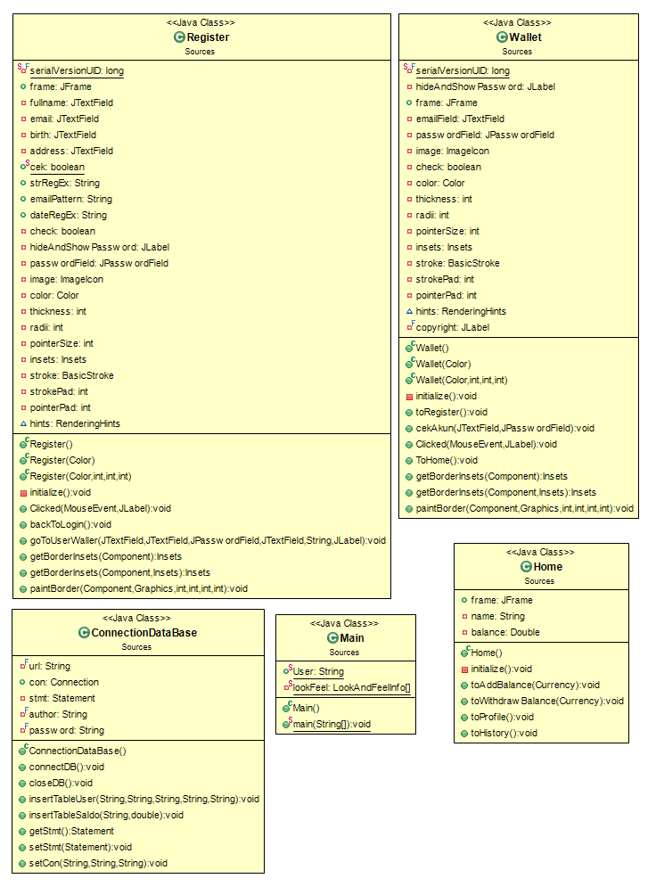

# PBO-A-TA-E-Wallet
This Project is for completing final project of PBO course

Our Collaborator:
1. Rusel Alexander /71180251 (Group A)
2. Yohanes Tennary Rinto Pradhana / 71180259 (Group A)
3. Ananda Apriliansah / 71180263 (Group A)
4. Yoga Kurnia Widi Pratama / 71180277 (Group A)

This App contains fitures:
1. Save Money
3. Withdraw Money
4. Auto Convert Money (USD to IDR)
5. History

Application that we used to build this app:
1. Eclipse IDE for Java Developers - 2019-12
2. Java SE Development Kit 13
3. Launch4j
4. GitHub
5. Figma

Requirement:
1. Java Version 8 Update 251

Class Diagram:
1. 
2. 
